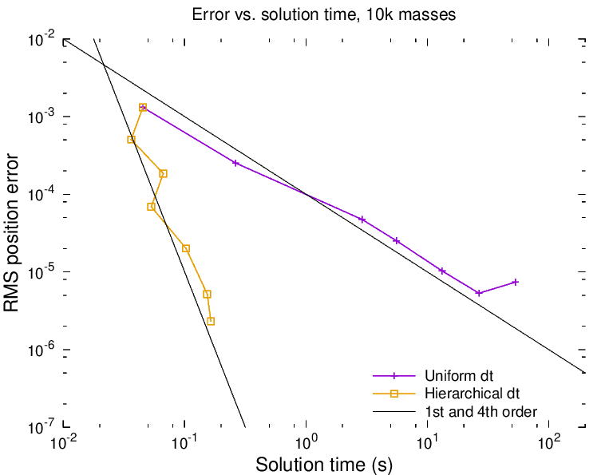

# adapDt
Test program for adaptive time stepping in a gravitational NBody system

## Description
This is a simple N-Body gravitational direct solver. The aim is to experiment with particle ordering
and methods to adapt the time step by factors of 2 for groups of particles in order to complete
the work faster with similar total error. As seen below, the method can run a simulation 100x faster
with no change in total system RMS error.

## Build and run
With `g++` installed, you can simply run:

	make
	./adapDt -n=10000 -s=5

Generate and save a re-usable set of particles, find the "true" solution, and compare to it later:

	./adapDt -n=10000 -s=0 -o=initial.dat
	./adapDt -n=10000 -s=10 -i=initial.dat -true -o=truesoln.dat
	./adapDt -n=10000 -s=10 -i=initial.dat -c=truesoln.dat

## Results

Above is a plot of the system RMS position error vs. total simulation time for an O(N^2) n-body
simulation of 10,000 particles in gravitational motion using 1st order Euler (explicit) time stepping.
The particles are clustered around the origin, and the particle masses distribution follows an
inverse power law.
The uniform Dt cases ran from 10 to 20,000 uniform time steps (dt=0.01 to 5.e-6).
The Hierarchical Dt case used 10 time steps at the coarsest level, and the data points represent
the case where the finest time step equals the coarse time step, and subsequent cases all allow
the finest time step to be refined by two factors of 2 for each data point on the plot.
The last data point on Hierarchical Dt case represents particles stepping at between 0.01 per
step and 0.01 * 0.5^12 = 2.4e-6.
For the Hierarchical case, the particles are first sorted by jerk magnitude, and then at each level,
50% of the particles with the highest initial jerk magnitude are flagged for time refinement.
Thus, the simulation is not truly solution-adaptive; for that, the jerk would need to be evaluated
at each time step and particles would be free to move toward more or less time-refinement to 
control error.

# To Do
* Keep the MPI version up-to-date
* Support higher-order forward integrators (Verlet or AB2 come to mind, but they must support [variable time step lengths](https://github.com/markstock/variableDt))
* Make the slow-fast splits solution-adaptive (according to jerk magnitude)
* Pull out the classes/structs to new header files
* Consider passing one std::span (c++20) instead of 3 separate values

